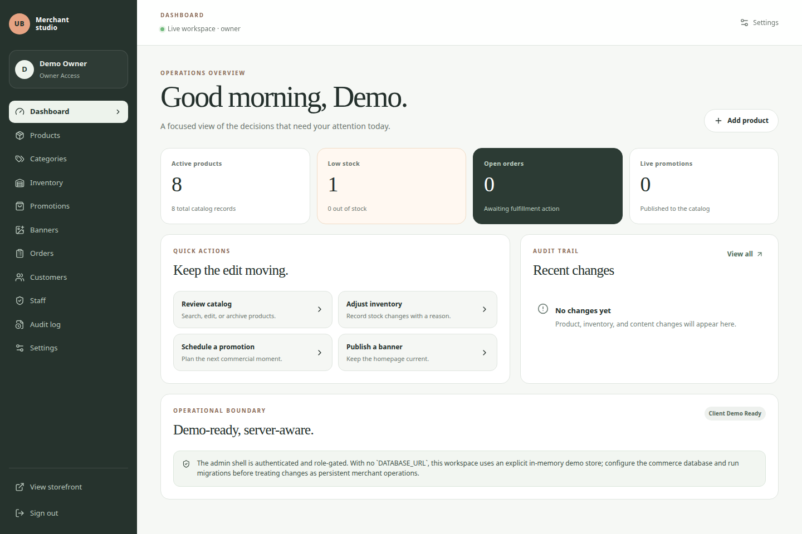
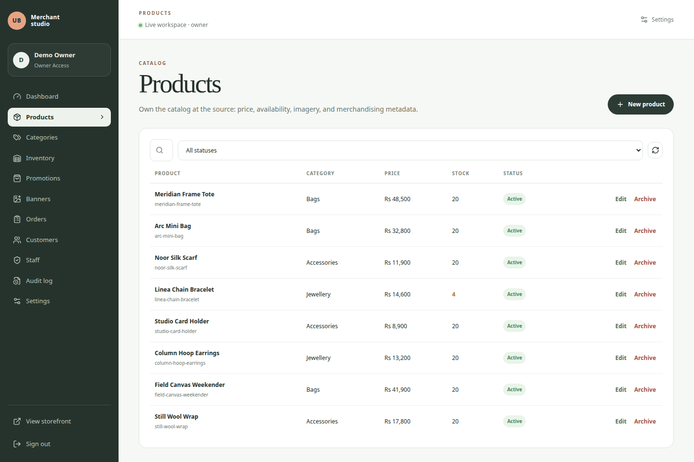
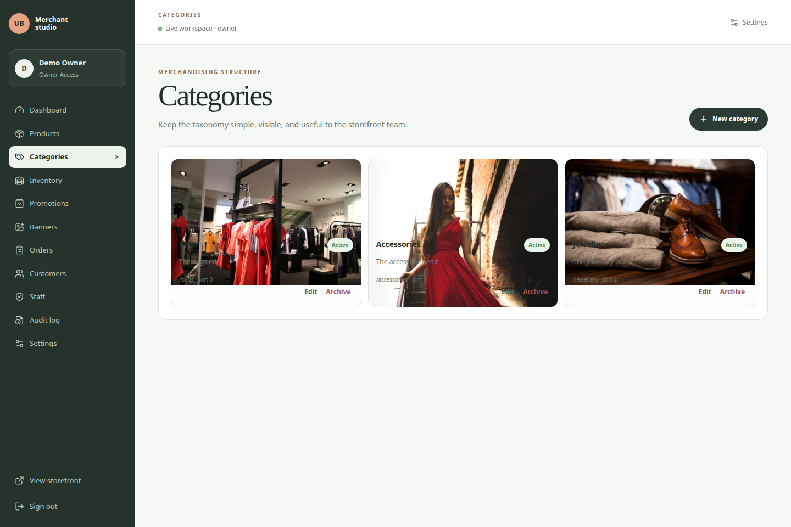
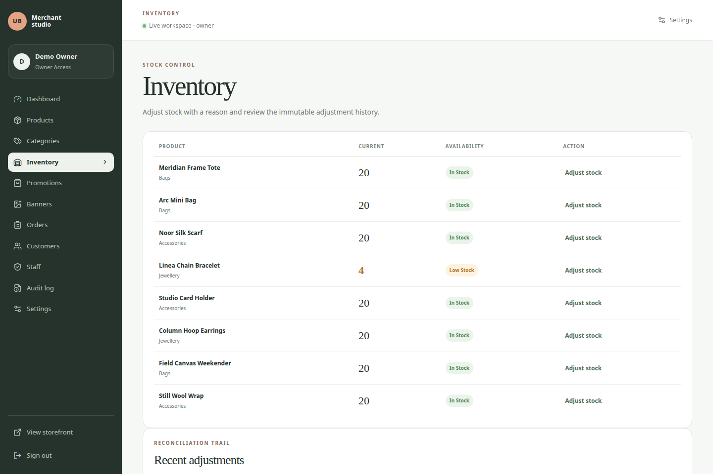
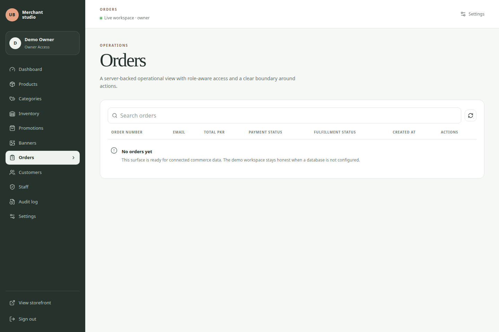

# Usamabhanbhro E-Commerce

A client-presentable e-commerce showcase for **Usamabhanbhro**. The repository pairs an editorial React storefront with a typed Express API boundary, durable PostgreSQL-backed commerce workflows, a merchant-facing CMS, S3-compatible media storage, automated validation, and GitHub Pages delivery.

> **Current classification: CLIENT DEMO READY**
>
> The repository demonstrates a complete storefront and merchant-operations workflow, but it is not a production commerce deployment. Public checkout uses deterministic mock behavior, and the `/admin` demo-owner path is intentionally limited to local development and test environments.

## Live demo

**[Open the deployed storefront](https://usamabhanbhro.github.io/e-commerce/)**

The live deployment is a static frontend hosted on GitHub Pages. GitHub Actions builds it from `main` with `pnpm build:pages`, preserves the `/e-commerce/` project base path, creates the client-side routing fallback, and publishes only the generated Pages artifact. GitHub Pages does not host the Express API, PostgreSQL, OAuth, payment adapters, or merchant CMS persistence.

## What this repository demonstrates

The public storefront presents a considered product-discovery and checkout journey. The server demonstrates how the same catalog can be governed by validation, role-aware administration, server-owned pricing, inventory integrity, idempotent payment boundaries, signed webhook handling, PostgreSQL persistence, and auditable operational changes. The browser demo intentionally uses mock payment outcomes and does not collect real financial credentials.

| Surface | Demonstrated behavior |
| --- | --- |
| Storefront | Editorial homepage, responsive navigation, mobile drawer, search, wishlist, bag state, collections, and product discovery |
| Catalog | Product grid, category filtering, sorting, availability, variants, related products, and accessible image text |
| Product detail | Gallery, variants, quantity controls, wishlist, add-to-bag, pricing, and related products |
| Checkout surface | Contact, shipping, delivery method, order summary, validation, empty state, and deterministic mock outcomes |
| Account boundary | Mock customer dashboard and authentication boundary pages |
| Commerce service | Server-side pricing, promotion resolution, order transitions, inventory reservation, idempotency, and webhook replay protection |
| Editorial content | Journal index, article pages, about page, contact state, and styled not-found route |
| Responsive UI | Desktop, tablet, and mobile layouts with reduced-motion support and keyboard-safe controls |
| Merchant CMS | Authenticated `/admin` control panel for catalog, inventory, merchandising, operations, staff, audit, and settings |

The public Pages demo is frontend-only. When the Express service is available, the storefront hydrates from `/api/catalog`; otherwise it retains its deterministic static catalog fallback. Merchant mutations require the server boundary and a configured database for durable persistence.

## Merchant CMS

The Merchant CMS is a custom internal tool under `/admin`. It is designed for a small merchant team that needs to maintain the catalog, merchandise the homepage, protect stock integrity, review orders, and understand who changed operational data. The browser handles navigation, forms, loading states, and empty states; the server remains the source of truth for authorization, validation, business rules, pricing, inventory, persistence, and audit events. [1] [2]

### CMS workflow coverage

| Workflow | What the merchant can do | Server-side safeguards |
| --- | --- | --- |
| Dashboard | Review active products, low-stock items, out-of-stock items, active promotions, pending orders, recent orders, recent audit events, and quick actions | Metrics are derived from the current catalog and operational records; navigation is filtered by the authenticated role |
| Products | Search and filter products; create, edit, archive, manage price and comparison price, assign category/collection, set stock/status/tags/featured state, and add, remove, or reorder images | Zod input validation, slug uniqueness, category-reference validation, archive action, role restrictions, audit events, and server-owned catalog synchronization |
| Categories | Create and edit category name, slug, description, image, status, and sort order; archive categories | Slug uniqueness and in-use safeguards prevent active products from being orphaned |
| Inventory | Review current stock and availability; apply positive or negative adjustments with a required reason; review recent adjustments | Non-negative stock enforcement, atomic PostgreSQL update predicates, conflict detection, adjustment history, and audit events |
| Promotions | Create and edit catalog-, category-, or product-targeted promotions; choose percentage or fixed discounts; schedule start/end dates; activate or deactivate campaigns | Target references are validated, discount bounds are enforced, lifecycle status is derived from dates, overlap selection is deterministic, and checkout resolves the same server-owned winner as the storefront |
| Homepage banners | Create and edit image-backed banners, CTA labels, destinations, schedules, publication state, and order; publish or unpublish the homepage sequence | Media validation, lifecycle resolution, deterministic ordering, role restrictions, audit events, and storefront consumption only for active records |
| Orders | Search the order list and move orders through permitted fulfillment states | The server enforces `pending → processing → packed → shipped → delivered` transitions and only permits cancellation from valid pre-terminal states |
| Customers | Search customer records and view order-count summaries | Read access is role-aware and the API does not expose unrelated secrets or credentials |
| Staff | Review merchant users and update non-owner roles | Owner-only management, owner-role protection, persistence required for real mutations, and audit events |
| Audit log | Filter by action, resource, or actor role and page through bounded results | The server applies role filtering, limit/offset bounds, immutable append-only event writes, and request IDs |
| Settings | Inspect workspace, environment, persistence, catalog, and payment diagnostics | Read-only and intentionally non-sensitive; no database credentials, OAuth secrets, payment secrets, or storage credentials are returned |

### Role matrix

The server resolves the role from the authenticated session and, when PostgreSQL is configured, the current `users.role` record. A browser-provided role or hidden navigation item is never trusted as authorization. [3]

| Capability | Owner | Admin | Staff |
| --- | ---: | ---: | ---: |
| Dashboard | Full | Full | Full |
| Products | Full | Full | Limited update/read |
| Categories | Yes | Yes | No |
| Inventory | Yes | Yes | Yes |
| Promotions | Yes | Yes | No |
| Banners | Yes | Yes | No |
| Orders | Yes | Yes | Yes |
| Customers | Yes | Yes | Limited read |
| Staff | Yes | No | No |
| Audit log | Yes | Yes | Limited read |
| Settings | Yes | Limited | No |

### CMS screenshots

The following images were captured from the actual local application after the explicit non-production demo-owner login. They are representative UI evidence, not conceptual mockups. The screenshots contain seeded demo catalog data only and no credentials, tokens, database URLs, private infrastructure values, or production customer information.

#### Dashboard and catalog management





#### Category and inventory operations





#### Operations



The repository also includes captured promotion and banner surfaces under [`docs/assets/cms/`](docs/assets/cms/), including their intentionally explicit empty states when no campaigns or homepage moments have been created in the local demo store.

## Storefront screenshots

These images are also captured from the real application and show the public customer-facing presentation. They are intentionally separate from the merchant CMS screenshots because the Pages deployment hosts the storefront only.


## Architecture at a glance

The browser application and merchant studio share the same frontend shell, but the CMS is governed by a separate server trust boundary. Public rendering may fall back to static catalog data; administrative actions do not bypass the API.

```mermaid
flowchart LR
  Browser[React + Vite storefront and /admin] --> Router[Wouter routes and CMS forms]
  Router --> Static[Static catalog fallback]
  Router -. authenticated requests .-> Session[Session or OAuth boundary]
  Session --> API[Express /api/admin and commerce API]
  API --> RBAC[Server role authorization]
  RBAC --> Validate[Zod validation and domain invariants]
  Validate --> Commerce[Commerce and promotion services]
  Commerce --> DB[(PostgreSQL via Drizzle)]
  Validate --> R2[S3-compatible media storage via R2 adapter]
  Commerce --> Audit[Append-only audit events]
  Browser --> PublicCatalog[/api/catalog]
  PublicCatalog --> Commerce
  GitHub[Push to main] --> Actions[GitHub Actions]
  Actions --> Pages[pnpm build:pages]
  Pages --> GitHubPages[GitHub Pages static frontend]
```

### Trust boundaries

Every administrative request follows the same order: session authentication, server-side role authorization, Zod validation, domain-rule enforcement, database or explicitly demo-only memory mutation, and audit-event recording. The UI can hide unavailable navigation, but it cannot grant permission. [3]

| Boundary | Responsibility | Source of truth |
| --- | --- | --- |
| Browser | Navigation, forms, loading states, and presentation | Server responses |
| Admin API | Authentication, RBAC, validation, business rules, and audit writes | Express route handlers and domain services |
| Catalog and commerce data | Product, order, inventory, promotion, and operational persistence | PostgreSQL through Drizzle when configured |
| Media | Validated upload intent, object access, and object deletion | Existing R2/S3-compatible storage adapter |
| Demo fallback | Local development and test rehearsal without a database | Explicit in-process memory store, never production persistence |
| Storefront | Customer-facing rendering and checkout boundary | `/api/catalog` when available, static catalog fallback otherwise |

### Storefront synchronization and canonical pricing

Published categories, active promotions, and active banners are resolved by the server catalog response. The client hydrates its existing catalog model after a successful `/api/catalog` request, while retaining the static fallback for frontend-only environments. The homepage uses the first active ordered banner when one exists and otherwise keeps the editorial hero. Product price, comparison price, stock, and promotion metadata originate from the server-owned catalog.

The shared promotion engine excludes expired and not-yet-started campaigns, validates catalog/category/product targets, bounds discount values, and selects the largest eligible discount with a stable identifier tie-breaker. The order service uses the same resolver, so a browser cannot submit a lower price than the server calculated. [3]

## API and data layer

The backend uses Express route handlers, Drizzle ORM, PostgreSQL, and the repository’s existing hand-maintained migration authority. The CMS adds additive entities for categories, promotions, banners, inventory adjustments, and audit events while continuing to use the existing catalog and order records. [4]

| Endpoint family | Operations |
| --- | --- |
| `/api/admin/bootstrap` | Current actor, allowed navigation, dashboard metrics, recent orders, and recent audit events |
| `/api/admin/products` | List, search/filter, create, update, archive |
| `/api/admin/categories` | List, create, update, archive |
| `/api/admin/inventory` | Read stock/history and create reasoned adjustments |
| `/api/admin/promotions` | List, create, update, activate/deactivate |
| `/api/admin/banners` | List, create, update, activate/deactivate, reorder |
| `/api/admin/orders` | List and permitted fulfillment transitions |
| `/api/admin/customers` | Search and order-history summary |
| `/api/admin/staff` | Owner-only list and non-owner role updates |
| `/api/admin/audit` | Filtered, bounded event history |
| `/api/admin/settings` | Non-sensitive operational diagnostics |
| `/api/admin/media/presign` | Validated upload intent through the storage adapter |
| `/api/admin/media` | Protected media-object deletion through the storage adapter |

When `DATABASE_URL` is absent, the same domain API uses an explicit seeded in-memory store so the UI remains demonstrable in development and test. A configured PostgreSQL database is required for durable merchant operations. No CMS route silently presents the memory store as production persistence.

## Security and secret boundaries

The security model is deliberately server-owned. Authentication comes from the existing session/OAuth boundary; role permissions are resolved on the server; request bodies are validated with Zod; domain rules reject invalid references, impossible status transitions, duplicate slugs, negative inventory, and unsafe promotion values; and mutations record audit events. [1] [3]

The API preserves the repository’s request IDs, security headers, CORS allowlist, scoped rate limits, sanitized error responses, HMAC webhook verification, and readiness checks. The browser receives presigned media intent rather than storage credentials. The client bundle must not contain database credentials, JWT secrets, payment credentials, webhook secrets, OAuth client secrets, object-storage keys, or owner identity values. [5]

The demo-owner login is available only when the application environment is development or test and the explicit demo-login boundary permits it. It is not a production authentication mechanism. Real staff mutations and order operations require a configured commerce database; the demo store is a rehearsal boundary, not a deployment substitute.

## Selected routes

| Route | Purpose |
| --- | --- |
| `/` | Editorial storefront homepage |
| `/shop` | Filterable and sortable product catalog |
| `/collections` | Collection overview |
| `/collections/:slug` | Collection detail and products |
| `/products/:slug` | Product detail and purchase surface |
| `/search` | Local search |
| `/cart` | Shopping bag |
| `/checkout` | Demo-only checkout |
| `/order-confirmation` | Local mock confirmation |
| `/account` | Account dashboard boundary |
| `/wishlist` | Saved products |
| `/journal` and `/journal/:slug` | Editorial journal and article pages |
| `/about` and `/contact` | Brand and contact surfaces |
| `/admin` | Authenticated merchant dashboard |
| `/admin/products` | Product CRUD-style management |
| `/admin/categories` | Category management |
| `/admin/inventory` | Stock and adjustment history |
| `/admin/promotions` | Promotion lifecycle management |
| `/admin/banners` | Homepage banner management |
| `/admin/orders` | Operational order view |
| `/admin/customers` | Customer lookup and order summary |
| `/admin/staff` | Owner-only role management |
| `/admin/audit` | Administrative event history |
| `/admin/settings` | Read-only operational diagnostics |

## Technology stack

| Layer | Technologies used in this repository |
| --- | --- |
| Frontend | React 19, TypeScript, Vite 7, Wouter, Tailwind CSS v4, Radix UI, Framer Motion |
| Backend | Node.js 22, Express 5, TypeScript, esbuild |
| Data layer | Drizzle ORM, PostgreSQL, idempotent SQL migrations, and deterministic seed scripts |
| Validation | TypeScript, Zod, Vitest, Playwright, visual snapshots, dependency audits, and release scanning |
| Storage | S3-compatible object storage through the existing Cloudflare R2-compatible adapter |
| Delivery | pnpm 10.34.5, GitHub Actions, and GitHub Pages |
| Runtime boundaries | Environment validation, CORS allowlisting, security headers, request IDs, scoped rate limits, sanitized errors, and HMAC webhook verification |

## Local development

### Prerequisites

Use Node.js 22 and pnpm 10.34.5. A database is not required for the static storefront or the local demo-owner CMS rehearsal. A configured PostgreSQL instance is required for durable merchant and commerce operations. Server-only variables are documented in [`docs/environment.md`](docs/environment.md).

### Install and run the storefront

```bash
pnpm install --frozen-lockfile
pnpm dev
```

Vite serves the client development application. Do not place server-only secrets in `VITE_*` variables because Vite variables can be embedded in browser assets.

### Run the built API and CMS rehearsal

```bash
pnpm install --frozen-lockfile
pnpm build
APP_ENV=development NODE_ENV=development PORT=4177 ALLOW_DEMO_LOGIN=true node dist/index.js
```

Open `http://127.0.0.1:4177/admin` and use the explicit local demo-owner path when prompted. The demo store is deterministic and in-memory when `DATABASE_URL` is absent. For durable testing, configure PostgreSQL and run the migration and seed commands described below.

### Database commands

```bash
pnpm db:generate
pnpm db:migrate
pnpm db:seed
pnpm db:verify
```

The repository uses PostgreSQL migrations and a PostgreSQL verification script. Never substitute production credentials into a local screenshot or test session.

## Testing and evidence

The latest validated implementation records the following gates. The CMS browser suite covers authenticated access, protected sections, promotion validation and storefront propagation, category CRUD, inventory history, audit filtering and pagination, and demo-mode staff persistence boundaries. [6]

| Gate | Result |
| --- | --- |
| Type-check | Passed |
| Lint | Passed; the repository lint script runs the TypeScript compiler check |
| Unit tests | **32/32 passed** |
| Full Playwright suite | **64 passed** |
| Merchant-admin suite | **6 passed** |
| Visual regression suite | **12/12 passed** against the approved homepage baselines |
| Production build | Passed |
| GitHub Pages build | Passed |
| Production dependency audit | No known vulnerabilities |
| Release secret scan | Passed |
| PostgreSQL staging validation | Passed, including migration, seed, integrity, and staging image checks |
| GitHub Pages workflow | Passed |

Visual snapshots are maintained as repository evidence. Homepage screenshots are captured with deterministic image loading so lazy-loaded editorial media does not create environment-only height differences. See [`docs/visual-regression-audit.md`](docs/visual-regression-audit.md) for the evidence-based baseline decision.

Run the main checks locally with:

```bash
pnpm check
pnpm lint
pnpm test
pnpm test:e2e
pnpm test:visual
pnpm build
pnpm build:pages
pnpm scan:release
pnpm audit:prod
pnpm audit:critical
```

## Deployment and staging boundary

Pushing to `main` or manually dispatching [`.github/workflows/deploy-pages.yml`](.github/workflows/deploy-pages.yml) builds the static frontend, passes the Pages base path to Vite, creates the generated `404.html` client-routing fallback, uploads `dist/public`, and deploys through the GitHub Pages environment. Generated build files are not committed.

The dedicated staging workflow validates the Express service, isolated PostgreSQL topology, S3-compatible storage boundary, exact-origin CORS, fail-closed readiness checks, server-only credentials, migrations, seed behavior, unit tests, browser tests, release scanning, and production container construction. It does not provision infrastructure or connect staging secrets automatically. [7]

A deployable CMS environment therefore requires an externally hosted Express API, managed PostgreSQL, S3-compatible storage, OAuth credentials and redirect URIs, production payment integration, backups, DNS/TLS/WAF, distributed rate limiting, monitoring, and alerting. Those external requirements are intentionally outside this repository session. The project remains **CLIENT DEMO READY**, not production-ready. See [`docs/production-readiness.md`](docs/production-readiness.md).

## Documentation map

| Document | Purpose |
| --- | --- |
| [`docs/architecture.md`](docs/architecture.md) | Frontend, backend, commerce, data, security, and deployment architecture |
| [`docs/admin-architecture.md`](docs/admin-architecture.md) | Merchant roles, API surface, persistence, audit, and storefront synchronization |
| [`docs/qa.md`](docs/qa.md) | Validation gates, test evidence, database rehearsal, and release hygiene |
| [`docs/deployment.md`](docs/deployment.md) | GitHub Pages workflow, artifact behavior, routing fallback, and domain setup |
| [`docs/staging-deployment.md`](docs/staging-deployment.md) | Isolated staging topology, secrets, storage, API wiring, validation, and manual provisioning boundary |
| [`docs/environment.md`](docs/environment.md) | Development, staging-like, production-like, and browser-secret boundaries |
| [`docs/postgresql-migration-audit.md`](docs/postgresql-migration-audit.md) | Historical persistence audit and migration boundary |
| [`docs/postgresql-migration-plan.md`](docs/postgresql-migration-plan.md) | PostgreSQL compatibility decisions and implementation sequence |
| [`docs/postgresql-data-migration.md`](docs/postgresql-data-migration.md) | Deterministic legacy-data export/import and row-count verification procedure |
| [`docs/production-readiness.md`](docs/production-readiness.md) | PASS/BLOCKED/NOT APPLICABLE production-readiness matrix |
| [`docs/release-checklist.md`](docs/release-checklist.md) | Release classification and pre-release checklist |
| [`docs/visual-regression-audit.md`](docs/visual-regression-audit.md) | Evidence and decisions for the approved visual baselines |
| [`PAGE_TOPOLOGY.md`](PAGE_TOPOLOGY.md) | Existing page and route topology |

## Important demo disclaimer

Do not enter real financial credentials or sensitive personal information into the showcase. The public checkout is a local demonstration surface. The merchant CMS demo-owner path is non-production. No claim is made that live payment processing, live customer accounts, production fulfillment, or production operations are available.

## References

[1]: server/admin.ts "Merchant CMS API routes, validation, roles, and audit writes"
[2]: client/src/pages/Admin.tsx "Merchant CMS user interface and controlled workflows"
[3]: docs/admin-architecture.md "Admin CMS architecture, trust boundaries, roles, API surface, and synchronization"
[4]: drizzle/schema.ts "PostgreSQL Drizzle schema and CMS entities"
[5]: server/storage.ts "S3-compatible media storage adapter and validation boundary"
[6]: tests/e2e/admin.spec.ts "Merchant CMS end-to-end coverage"
[7]: .github/workflows/staging-validate.yml "PostgreSQL staging validation workflow"
