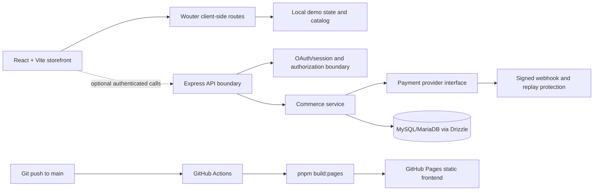
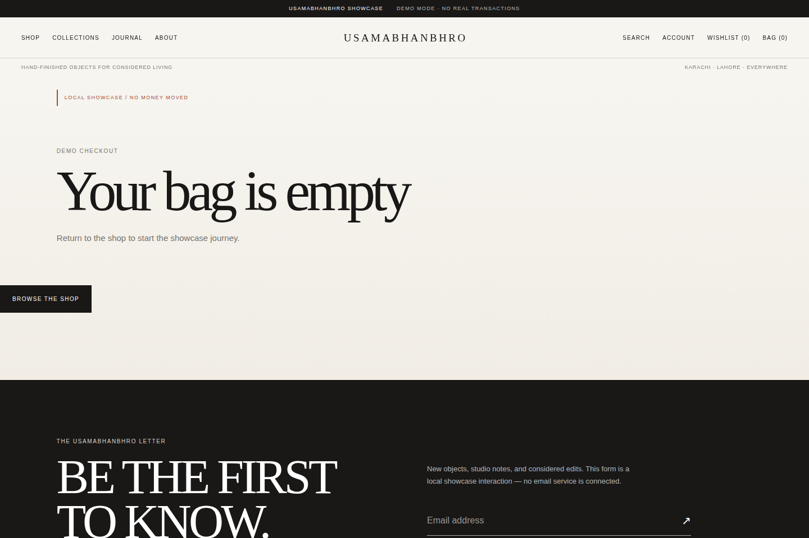
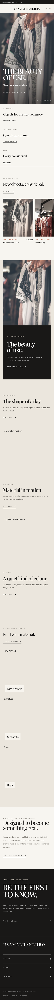

# Usamabhanbhro E-Commerce

A reconstructed, client-presentable e-commerce showcase for **Usamabhanbhro**. The project demonstrates how an editorial storefront can be paired with a typed React frontend, a security-conscious Express API boundary, durable commerce workflows, MariaDB persistence, payment-provider interfaces, automated testing, and GitHub Pages deployment.

> **Current classification: CLIENT DEMO READY**
>
> This is a reconstructed release candidate created from the existing `Usamabhanbhro/e-commerce` baseline after loss of the previously validated worktree. It is not a recovered copy of the lost implementation, and it is not a production commerce deployment.

## Live demo

**[Open the deployed storefront](https://usamabhanbhro.github.io/e-commerce/)**

The live site is a static frontend demonstration hosted on GitHub Pages. The deployment is built from `main` by [GitHub Actions](https://github.com/Usamabhanbhro/e-commerce/actions), uses the existing `pnpm build:pages` command, preserves the `/e-commerce/` project base path, and supports client-side routes through the generated Pages fallback.

## What the project demonstrates

The storefront gives a potential client a realistic product-discovery and checkout journey while giving a technical reviewer a compact example of frontend architecture, backend boundaries, commerce integrity, security controls, database modeling, automated validation, and CI/CD. The public Pages demo intentionally uses local mock behavior; it does not collect real payment credentials or claim that live commerce is operational.

## Demonstrated storefront journeys

| Area | Verified capability |
| --- | --- |
| Storefront | Editorial homepage, responsive navigation, mobile drawer, wishlist and bag counts |
| Catalog | Product grid, category filtering, sorting, availability, variants, related products, and accessible image text |
| Collections | Collection index and collection-specific product browsing |
| Product detail | Gallery, variants, quantity controls, wishlist, add-to-bag, and related products |
| Search | Local matching, query state, and empty results state |
| Cart | Local persistence, quantity changes, removal, subtotal, delivery estimate, empty state, and suggestions |
| Checkout surface | Contact, shipping, delivery method, order summary, validation, and mock outcome states |
| Account | Mock customer dashboard and authentication boundary pages |
| Commerce layer | Server-side pricing, order transitions, inventory reservation, idempotency, and webhook replay protection in the backend rehearsal |
| Payments | Provider-independent interface with deterministic mock/sandbox boundaries; no real provider credentials are included |
| Editorial content | Journal index, article pages, about page, contact state, and styled not-found route |
| Responsive UI | Desktop, tablet, and mobile layouts with reduced-motion support and keyboard-safe controls |
| Merchant studio | Authenticated `/admin` control panel with owner/admin/staff RBAC, server-owned catalog, inventory adjustments, promotions, banners, operations views, and audit trail |

The public demo’s catalog, cart, wishlist, newsletter, contact, and order interactions are showcase behavior. The backend contains the durable commerce implementation and test boundaries, but GitHub Pages hosts only the frontend.

## Merchant studio

The `/admin` route is a custom internal tool rather than a customer-facing dashboard. It opens with an authenticated gate, offers an explicitly labeled local demo-owner workspace outside production, and keeps authorization on the server. The dashboard covers products, categories, inventory, promotions, homepage banners, orders, customers, staff roles, audit history, and non-sensitive settings diagnostics.

| Admin capability | Implementation boundary |
| --- | --- |
| Authentication | Existing session/OAuth boundary plus non-production-only demo login |
| Authorization | Server-enforced `owner`, `admin`, and `staff` permissions; browser navigation is not trusted |
| Catalog | CRUD-style product and category management with archive safeguards and server-owned storefront synchronization |
| Inventory | Reasoned stock adjustments with negative-stock rejection and database conflict protection |
| Merchandising | Promotion lifecycle controls and ordered homepage banner publishing |
| Operations | Orders, customers, staff, audit, and settings views with role-aware access |
| Persistence | Drizzle/MySQL-compatible tables when `DATABASE_URL` is configured; deterministic in-memory rehearsal store otherwise |

The admin workspace is demonstrable in local development and intentionally remains **CLIENT DEMO READY**. It does not turn GitHub Pages into a backend host, does not expose server secrets to the browser, and does not imply production persistence when the database is absent. See [`docs/admin-architecture.md`](docs/admin-architecture.md) for the role matrix, API boundaries, migration strategy, and storefront synchronization details.

## Selected routes

| Route | Purpose |
| --- | --- |
| `/` | Storefront homepage |
| `/shop` | Filterable and sortable product catalog |
| `/collections` | Collection overview |
| `/collections/:slug` | Collection detail and products |
| `/products/:slug` | Product detail and purchase surface |
| `/search` | Local search |
| `/cart` | Shopping bag |
| `/checkout` | Demo-only checkout |
| `/order-confirmation` | Local mock confirmation |
| `/account` | Account dashboard boundary |
| `/wishlist` | Saved products |
| `/journal` and `/journal/:slug` | Editorial journal and article pages |
| `/about` and `/contact` | Brand and contact surfaces |
| `/admin` | Authenticated merchant dashboard and operational control panel; local demo-owner entry is explicitly non-production |
| `/admin/products` through `/admin/settings` | Protected catalog, inventory, merchandising, operations, staff, audit, and settings surfaces |

## Technology stack

| Layer | Technologies used in this repository |
| --- | --- |
| Frontend | React 19, TypeScript, Vite 7, Wouter, Tailwind CSS v4, Radix UI, Framer Motion |
| Backend | Node.js 22, Express 5, TypeScript, esbuild |
| Data layer | Drizzle ORM, MySQL/MariaDB, idempotent SQL migrations and deterministic seed scripts |
| Validation | TypeScript compiler, Vitest, Playwright, reconstructed visual snapshots, npm-style dependency audits, release scan |
| Delivery | pnpm 10.34.5, GitHub Actions, GitHub Pages |
| Runtime boundaries | Environment validation, CORS allowlisting, security headers, request IDs, scoped rate limits, sanitized errors, HMAC webhook verification |

## Architecture at a glance

The repository separates the browser application, server/API boundary, shared contracts, and database schema. The frontend is independently deployable as a static Pages artifact; the backend remains a separate Node/Express service for any future staging or production environment.



See [`docs/architecture.md`](docs/architecture.md) for the detailed frontend, backend, commerce, database, and deployment explanation.

## Testing and evidence

The current reconstructed candidate records the following evidence:

| Gate | Result |
| --- | --- |
| Unit tests | **26/26 passed** including admin RBAC coverage |
| Functional browser tests | **48/48 passed** including merchant studio access and sections |
| Visual tests | **12/12 passed against refreshed reconstructed baselines** |
| TypeScript and lint | Passed |
| Production and Pages builds | Passed |
| Database rehearsal | Passed; 36 products and 8 collections seeded |
| Runtime/security probes | Passed for health, readiness, headers, CORS, authorization, webhook rejection, storage validation, and SPA fallback |
| GitHub Pages deployment | Passed; build and deploy jobs completed successfully |

The 12 visual snapshots are **new reconstructed baselines** for this candidate. They are not historical snapshots recovered from the lost worktree. See [`docs/qa.md`](docs/qa.md) for the test gates and evidence policy.

## Local development

### Prerequisites

Use Node.js 22 and pnpm 10.34.5. A database is not required for the static frontend showcase, but the backend rehearsal requires a reachable MySQL/MariaDB instance and the server-only variables described in [`docs/environment.md`](docs/environment.md).

### Install and run the frontend

```bash
pnpm install --frozen-lockfile
pnpm dev
```

Vite serves the client on its development port and exposes the existing browser application. Do not place server-only secrets in `VITE_*` variables: Vite variables are eligible for inclusion in browser assets.

### Run repository checks

```bash
pnpm check
pnpm lint
pnpm test
pnpm build
pnpm build:pages
pnpm scan:release
pnpm audit:prod
pnpm audit:critical
pnpm test:e2e
pnpm test:visual
```

The browser workflows install the managed Chromium dependency in CI. For a local staging-like run, follow the environment and QA instructions rather than inventing production credentials.

### Pages deployment

Pushes to `main` and manual workflow dispatches run [`.github/workflows/deploy-pages.yml`](.github/workflows/deploy-pages.yml). The workflow installs the locked pnpm dependency graph, calls the existing `pnpm build:pages` script, passes the Pages project base path into Vite, creates a transient `404.html` fallback from the generated entry document, uploads `dist/public`, and deploys it through the `github-pages` environment. Generated build files are not committed.

GitHub Pages hosts the static frontend only. It does not host the Express API, MySQL/MariaDB database, payment adapters, OAuth provider, scheduled backups, or operational infrastructure.

See [`docs/deployment.md`](docs/deployment.md) for deployment details and custom-domain readiness.

## Environment and security boundaries

The checked-in [`.env.example`](.env.example) documents the server configuration shape. Development may use mock payment behavior and local origins. Staging-like and production-like environments require validated secrets, database connectivity, and explicit origin configuration.

Safe browser configuration may include public values such as a Pages base path or a public application identifier. Server-only values must never enter the Pages bundle, including database credentials, JWT secrets, payment credentials, webhook secrets, OAuth client secrets, and administrative identity values. See [`docs/environment.md`](docs/environment.md) for the complete boundary.

## Production readiness

This release is **not production-ready**. Live commerce remains blocked until the following external requirements are independently provisioned and evidenced:

- OAuth credentials and registered redirect URIs.
- An official production payment adapter and provider credentials.
- Managed production MySQL/MariaDB.
- Encrypted scheduled backups and a verified restoration procedure.
- S3-compatible storage and production policy.
- Production `OWNER_OPEN_ID`.
- DNS, TLS, and WAF/edge protection.
- Distributed rate limiting, centralized monitoring, and alerting.

Mock payment outcomes are suitable only for deterministic demos and rehearsal. They must not be represented as real transactions. The full matrix is in [`docs/production-readiness.md`](docs/production-readiness.md).

## Screenshots

The screenshots below are captured from the actual deployed application and stored under [`docs/assets/`](docs/assets/).

### Storefront and catalog


### Product and checkout journey




### Responsive presentation



## Documentation map

| Document | Purpose |
| --- | --- |
| [`docs/architecture.md`](docs/architecture.md) | Application, commerce, data, security, and deployment architecture |
| [`docs/admin-architecture.md`](docs/admin-architecture.md) | Merchant studio roles, API surface, persistence, audit, and storefront synchronization |
| [`docs/qa.md`](docs/qa.md) | Validation gates, test evidence, database rehearsal, and release hygiene |
| [`docs/deployment.md`](docs/deployment.md) | GitHub Pages workflow, artifact behavior, routing fallback, and domain setup |
| [`docs/environment.md`](docs/environment.md) | Development, staging-like, production-like, and browser-secret boundaries |
| [`docs/production-readiness.md`](docs/production-readiness.md) | PASS/BLOCKED/NOT APPLICABLE production-readiness matrix |
| [`docs/release-checklist.md`](docs/release-checklist.md) | Release classification and pre-release checklist |
| [`PAGE_TOPOLOGY.md`](PAGE_TOPOLOGY.md) | Existing page and route topology |

## Important demo disclaimer

Do not enter real financial credentials or sensitive personal information into the showcase. The public checkout is a local demonstration surface. No claim is made that live payment processing, live customer accounts, production fulfillment, or production operations are available.
