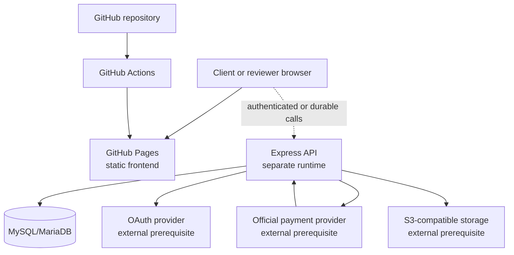
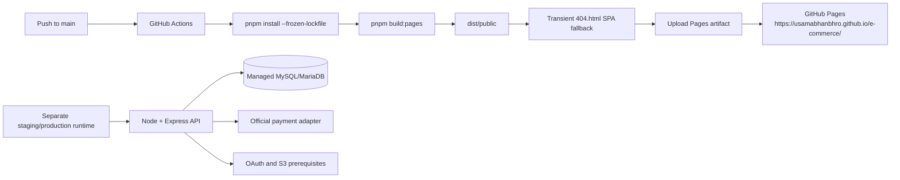

# Architecture

## Scope and classification

Usamabhanbhro E-Commerce is a reconstructed release candidate prepared for client demonstration and software-engineering portfolio review. The current classification is **CLIENT DEMO READY**. The architecture documents what is present in the repository; it does not imply that external production infrastructure or live commerce credentials have been provisioned.

The system has two intentionally separate delivery surfaces:

1. A browser storefront that can be built as static assets and deployed to GitHub Pages.
2. A Node/Express API and durable commerce boundary that can run against MySQL/MariaDB in a staging-like or future production environment.

GitHub Pages hosts only the first surface. It is not the production backend, database, payment gateway, OAuth provider, file store, or operations platform.

## System context



## Frontend

The frontend is a React 19 and TypeScript application built with Vite 7. `client/src/main.tsx` provides the browser entrypoint, while `client/src/App.tsx` composes the application shell, shared providers, navigation, and route table. Wouter supplies client-side routing without introducing a second application framework.

The storefront domain is organized around a local catalog and presentation model, commerce state, reusable components, and page-level route modules. The public Pages build is intentionally self-contained: it can present the catalog, cart, wishlist, checkout surface, account boundary, editorial content, and responsive layouts without requiring backend secrets.

The current frontend route map includes:

| Route family | Responsibility |
| --- | --- |
| `/`, `/shop`, `/collections`, `/collections/:slug` | Homepage, catalog, and collection discovery |
| `/products/:slug`, `/search` | Product detail and local search |
| `/cart`, `/checkout`, `/order-confirmation` | Bag, demo checkout, and local confirmation |
| `/account`, `/wishlist` | Account boundary and saved products |
| `/journal`, `/journal/:slug`, `/about`, `/contact` | Editorial and informational surfaces |
| Any unknown route | Styled not-found page |

State that is intentionally local to the public demo includes product presentation data, cart lines, wishlist entries, newsletter state, contact state, and showcase order state. This makes the Pages deployment deterministic and avoids putting server-only credentials into browser assets.

## Backend and API boundary

The backend is an Express 5 application written in TypeScript and bundled with esbuild. The server bootstrap validates environment configuration, exposes health and readiness probes, serves the built SPA in a production-like run, and mounts API routes for account, catalog, commerce, storage, and payment-related behavior.

The API boundary is responsible for concerns that must not be trusted to the browser:

- Request validation and environment validation.
- Authentication and authorization boundaries.
- Database access through Drizzle ORM.
- Server-side price and order handling.
- Atomic inventory reservation and release.
- Payment-attempt state transitions and idempotency.
- Signed webhook verification and duplicate-event handling.
- CORS allowlisting, security headers, request IDs, scoped rate limits, and sanitized production errors.

The backend can be rehearsed independently of GitHub Pages. A browser request to the Pages site must not be interpreted as evidence that the separate API is deployed there.

## Authentication and authorization

The repository includes an OAuth/session boundary and server-side authorization checks. Public browser surfaces do not expose OAuth client secrets. Server-only values such as `OAUTH_CLIENT_SECRET`, `JWT_SECRET`, and `OWNER_OPEN_ID` belong in the runtime environment, not in `VITE_*` variables or generated Pages assets.

Account and administrative behavior is treated as a boundary rather than a frontend claim. The QA suite covers OAuth error handling, unauthenticated account access, authorization denial, and the production-like server’s security responses.

## Commerce layer

Commerce behavior is separated from UI concerns so a future official provider can replace the deterministic demo adapter without rewriting checkout presentation. The intended production boundary is:

```text
Checkout UI
  -> Order service
  -> Payment service
  -> PaymentProvider interface
  -> Official provider adapter
```

The backend commerce service covers:

- Server-side product and price lookup.
- Order creation and status transitions.
- Atomic inventory reservation with a `stock >= quantity` guard.
- Payment attempts with unique idempotency keys.
- Monotonic payment status transitions.
- Failed or cancelled payment release exactly once.
- Successful payment commitment of reserved inventory.
- Webhook event uniqueness and replay protection.

The current demo payment modes are deterministic and provider-agnostic. The named wallet/payment options are presentation selectors and mock or sandbox boundaries; they are not production integrations. `PAYMENT_MODE=production` is designed to fail closed unless an official adapter is explicitly configured.

## Database

Drizzle ORM maps the MySQL/MariaDB schema defined in `drizzle/schema.ts`. The schema includes the following principal tables:

| Table | Responsibility |
| --- | --- |
| `users` | Customer identity and account records |
| `catalog_collections` | Collection metadata |
| `catalog_products` | Product catalog and stock fields |
| `orders` | Durable order state and totals |
| `order_items` | Order line items and captured pricing |
| `payment_attempts` | Payment state and idempotency keys |
| `payment_webhook_events` | Unique webhook event records |
| `saved_cart_lines` | Durable saved cart lines |
| `wishlist_items` | Customer wishlist entries |
| `customer_addresses` | Customer delivery addresses |

The repository includes idempotent migrations and a deterministic seed path. The documented rehearsal seeds 36 products and 8 collections. The database rehearsal also exercises concurrent inventory reservations, payment idempotency, webhook replay protection, and failed-payment stock restoration.

## Security controls

The production-like server and QA probes cover the following controls:

| Control | Implementation boundary |
| --- | --- |
| Configuration validation | Required secrets and environment values are validated before production-like startup |
| CORS | Explicit origin allowlist; untrusted origins are rejected |
| Request tracing | Request IDs are returned for operational correlation |
| HTTP hardening | Security headers are applied by the server boundary |
| Rate limiting | Limits are scoped to API, auth, and storage paths |
| Error handling | Production errors are sanitized rather than exposing internal details |
| Webhook integrity | Payment callbacks require a valid HMAC signature |
| Storage safety | Storage-key validation rejects unsafe traversal/input |
| Release hygiene | Secret, legacy-brand, and local-endpoint scans run before release |

These controls support the demo and rehearsal classification. They do not replace a production threat model, managed infrastructure, provider review, or operational monitoring.

## Deployment topology



The Pages workflow obtains the repository project base path from `actions/configure-pages`, passes it to Vite via `VITE_PAGES_BASE_PATH`, builds the existing Pages target, creates a deployment-only `404.html` from the entry document, and uploads `dist/public`. The fallback is not committed to Git and exists only inside the Pages artifact.

## Extension points

The project is structured so that future production work can be added without redesigning the public presentation layer:

- Replace the demo payment provider registry with an official server-side adapter.
- Connect the durable catalog, cart, account, and order APIs to managed infrastructure.
- Add an OAuth application with registered redirect URIs and server-only credentials.
- Configure S3-compatible object storage for managed media.
- Add operational monitoring, alerting, WAF/edge controls, distributed rate limits, and encrypted backup/restore evidence.

Until those prerequisites are independently provisioned and verified, the honest status remains **CLIENT DEMO READY**.
